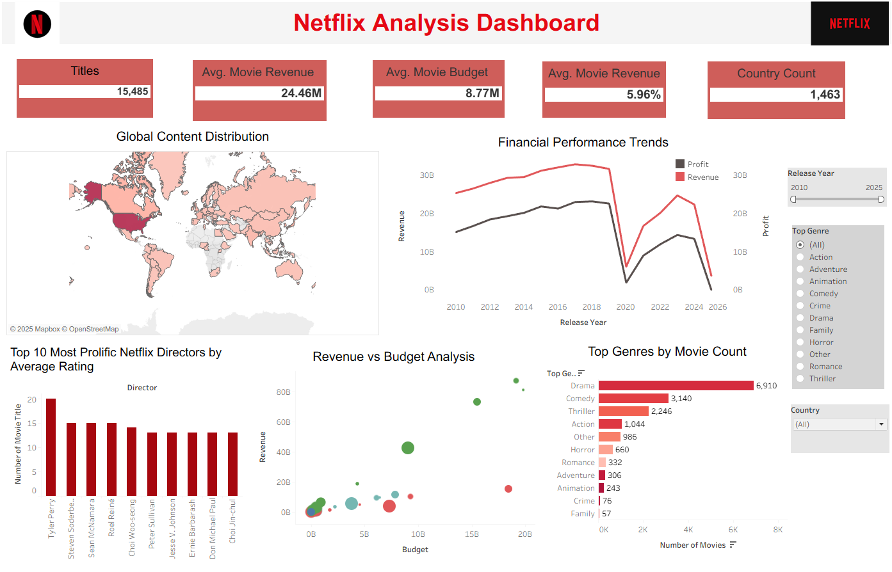

# 🎬 Netflix Analysis Dashboard
## 🎥 About the Project

The **Netflix Analysis Dashboard** is an interactive Tableau project that provides detailed insights into Netflix's **movie catalog** up to 2025.  
It covers key aspects such as **global content distribution**, **financial trends**, **top directors**, and **genre analysis**.

The dashboard allows users to explore Netflix's expansion strategy, content diversity, and budget-performance metrics.  
With filterable visualizations, users can dive into **release years**, **countries**, **ratings**, and **durations** to uncover data-driven stories.

This project is designed for data enthusiasts, analysts, and anyone interested in the **streaming industry landscape**.  
The dataset includes details on **titles, directors, cast, revenue, budget, genres, and more**, making it ideal for both visual exploration and future predictive analysis.

---
## 📊 **Overview**

This repository includes:

- 📈 A **Tableau Dashboard** showcasing key metrics and visualizations.
- 📂 **Source data**: `netflix_movies_detailed_up_to_2025.csv`
- 📝 **Instructions** to replicate or explore the analysis.

---

## 📂 Data Source
The dataset includes detailed Netflix movie information:
- Title, Director, Cast
- Country of Origin
- Release Year
- Rating (e.g., PG, R, TV-MA)
- Duration (Minutes)
- Genres
- Budget, Revenue, and Profit
  
---

## 🖼️ **Dashboard Screenshot**

---

## 🚀 **Features**

- **🌍 Global Content Distribution**  
  Visualizes the geographical spread of Netflix titles across countries.

- **💰 Financial Performance Trends**  
  Tracks movie **budget, revenue, and profit** across different release years.

- **🎥 Top Directors**  
  Highlights the most prolific directors on Netflix based on the **number of movies** and **average ratings**.

- **🎭 Genre Analysis**  
  Displays the popularity of movie genres by **count** and **duration**.

- **📌 Key Metrics Dashboard**  
  Includes KPIs like:
  - Total Movies  
  - Average Movie Revenue  
  - Average Budget  
  - Revenue Percentage  
  - Country Coverage

---

## 🔮 Future Work & Enhancements

This project can be further extended with the following enhancements:

### 📈 1. Viewer Engagement Metrics
- Integrate **watch time**, **user ratings**, or **viewer reviews** to analyze audience engagement.

### 🧠 2. Recommendation Engine Prototype
- Develop a **content-based recommendation system** using the dataset (based on genre, director, rating, etc.).

### 🎞️ 3. Streaming Competitor Comparison
- Expand the analysis to include data from **Amazon Prime Video**, **Disney+**, **Hulu**, and other competitors.
- Compare content libraries by **genre**, **budget**, and **release patterns**.

### 🗓️ 4. Time-to-Platform Analysis
- Calculate the **time gap between theatrical release and Netflix availability**.
- Identify trends in **content acquisition speed** over time.

